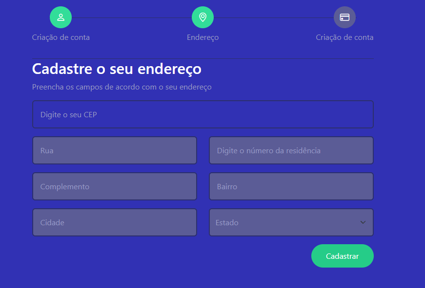
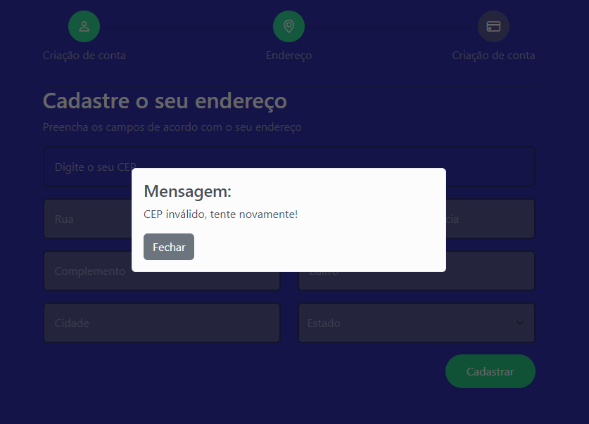

## Projeto de Consulta de CEP com ViaCEP API

Este projeto consiste em um formulário que permite ao usuário inserir um CEP válido contendo apenas números (máximo de 8 dígitos) para obter informações de endereço, como cidade e bairro, através da API ViaCEP. O formulário possui uma validação que impede a submissão de valores inválidos.

  

## 🚀 Tecnologias Utilizadas

- [HTML5](https://www.w3schools.com/) 
- [CSS3](https://www.w3schools.com/) 
- [JavaScript](https://www.w3schools.com/) 
- [APIViaCEP](https://viacep.com.br/) 
- [Bootstrap](https://getbootstrap.com/) 

## 🔵 Funcionamento

🔹O usuário deve acessar o formulário e inserir o CEP desejado. 
🔹O campo de CEP permite apenas a digitação de números e aceita no máximo 8 dígitos. 
🔹Ao preencher o CEP por completo, o sistema verifica se o valor inserido é válido. 
🔹Caso o CEP seja válido, o sistema faz uma requisição à API ViaCEP para obter as informações de endereço correspondentes. 
🔹As informações de rua,cidade e bairro são preenchidas automaticamente com base nos dados retornados pela API. 
🔹Caso o cep seja inválido, será apresentado uma mensagem ao usuário e os campos serão limpos. 

  

## ❓ Como utilizar

### Como instalar

1 - Faça o clone deste repositório para o seu ambiente local. 
2 - Entre no diretório e navegue até a pasta do projeto. 
3 - Abra o index.html no seu navegador 

### API ViaCEP

O projeto utiliza a API gratuita e pública do ViaCEP para obter informações de endereço com base no CEP fornecido. A API retorna os dados em formato JSON, e o projeto faz uma requisição utilizando o CEP informado pelo usuário para obter a cidade e o bairro correspondentes.

Para mais informações sobre a API ViaCEP, acesse https://viacep.com.br/.

#### Licença

Este projeto está licenciado sob a licença MIT. Consulte o arquivo LICENSE para obter mais informações.
